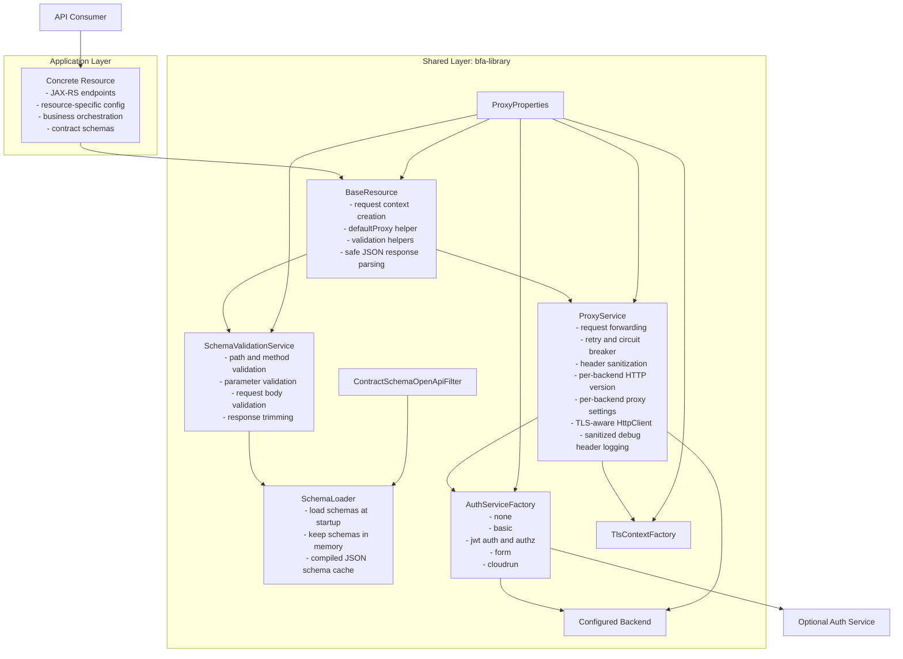

# BFA Library

Shared Quarkus runtime library for schema-driven backend forwarding.

## Scope

This module contains the reusable runtime pieces that are shared by proxy-style applications:

- `BaseResource`
- shared config mapping in `ProxyProperties`
- request context and validation models
- schema loading and validation
- forwarding, auth, and outbound TLS services
- OpenAPI decoration from loaded contract schemas
- auth-service transport and auth strategy wiring
- per-backend transport tuning such as outbound proxy and HTTP version

This module does not define concrete HTTP resources. Concrete resources, their config, and their published contract schemas remain application-owned.

## Architecture



## Schema Contract

The library assumes a single schema location configured by:

```yaml
gateway:
  schemas:
    directory: classpath:schemas/
```

Behavior:

- all schema files from that directory are loaded once at startup
- loaded schemas are kept in memory for runtime validation and OpenAPI decoration
- schemas are never reloaded during normal runtime
- an explicit reload hook exists for development and testing, and refreshes both validation and OpenAPI-decoration caches

This means downstream applications should place all contract and backend schemas under one shared directory, typically `src/main/resources/schemas/`.

## Runtime Responsibilities

- validate incoming requests against loaded OpenAPI contracts
- reject malformed or otherwise unprocessable JSON request bodies when `gateway.schemas.validate-bodies=true`
- optionally trim JSON responses to schema-defined fields
- forward requests to configured backends
- preserve multi-value inbound headers during forwarding while still exposing normalized single-value accessors to resources and auth helpers
- enrich outbound requests with auth strategies
- apply outbound truststore and mTLS configuration
- decode gzipped upstream responses before response parsing and trimming
- decorate generated Swagger/OpenAPI output from in-memory contract schemas

## Auth Strategies

The library provides shared auth strategy wiring through `AuthServiceFactory`. Supported modes currently include:

- `none`
- `basic`
- `jwt`
- `form`
- `cloudrun`

Notable behavior:

- `jwt` supports configurable token-to-header mapping, sparse `auth-request` bodies, and optional `authz-request` follow-up calls
- `jwt` also preserves the legacy default header injection behavior (`X-Glue-Token`, `X-Auth-Z-Token`, `X-Customer-Access-Token`) when no explicit bearer or token-header mapping is configured
- `jwt` supports auth-request path overrides and authz-request path configuration, including absolute URLs
- `form` supports both `auth-service` and `inline` modes
- `form` inline mode expects `application/x-www-form-urlencoded` on the forwarded request
- `cloudrun` adds service-to-service identity for Cloud Run protected upstreams

Auth failures are categorized so applications get clearer responses:

- missing or invalid caller authentication can return `401`
- authorization denials can return `403`
- proxy or auth configuration errors can return `500`
- open circuit breakers can return `503`
- broken or unavailable upstream or auth dependencies can return `502`

## Transport Behavior

`ProxyService` owns outbound backend transport behavior. Current shared features include:

- per-backend TLS profile selection
- optional per-backend outbound proxy settings
- per-backend HTTP version selection, with `HTTP/1.1` as the safe default
- response header sanitization before data is returned to the API consumer
- optional JSON response trimming to the schema-defined contract when enabled by the application
- sanitized debug logging of outbound backend headers

The auth-service caller uses the same shared transport principles, but auth-service-specific settings remain part of the shared library internals rather than per-backend application config.

## What You Can Build On Top

Applications using this library can build:

- simple pass-through proxy resources
- CRUD resources backed by one or more configured backends
- orchestration resources that aggregate multiple backend calls
- transformation/composition resources that reshape backend responses
- Cloud Run protected resources using service-to-service IAM auth
- legacy backend adapters with TLS, mTLS, or backend-specific auth behavior

The library owns the transport, contract, auth, and validation mechanics. The application layer owns resource paths, business logic, orchestration, and published contracts.

## More Information

For concrete examples, application-level patterns, and end-to-end configuration shapes, see the proxy module guide:

- [proxy/README.md](../proxy/README.md)
